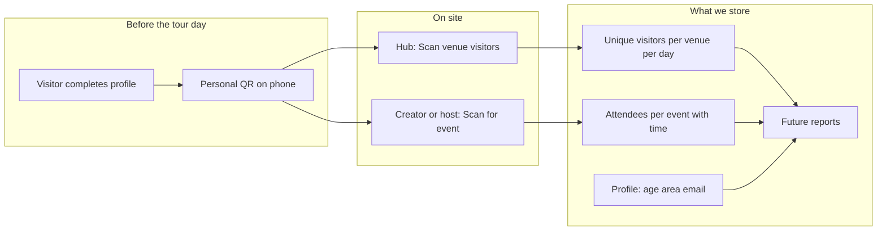

# GLUE QR Check-In — What We Collect & What You Can Measure

*A plain-language overview for tour leadership*

---

## Why we built this

GLUE now has a dedicated **QR Scan** area in the participant dashboard. It lets hosts and event creators check visitors in with a simple phone camera — the same way you might scan a ticket at the door.

Every successful scan is recorded quietly in the background. That gives us a reliable picture of **who showed up**, **when they arrived**, and **where** — without asking visitors to fill in forms at the entrance.

This document explains what information we collect today, and what reports we will be able to build from it — especially for **hub hosts** (venue owners) and **event creators** (participants running a specific program item).

---

## How it works — the visitor’s side

Before a visitor can be scanned, they complete a short **Visitor Profile** in the GLUE app:

- First and last name  
- Email  
- Age range (a bracket, not an exact birthday)  
- Professional area / sector (e.g. architecture, design, education)

This keeps the visitor experience simple: one QR for the whole tour, many possible check-in points.

---

## How it works — the host’s side

Participants open **QR Scan** in their dashboard. They see clear cards — one tap opens the camera:

| Scan type | Who uses it | What it measures |
|-----------|-------------|------------------|
| **Scan venue visitors** | Hub hosts only | Total unique visitors at your location on that tour day |
| **Scan for a specific event** | Event creators; hub hosts (for events at their venue) | Attendance for that individual event |

Scanning is only allowed on the **actual tour day** (based on the device’s local date), so check-ins stay aligned with real foot traffic on site.

---

## Two layers of attendance — why both matter

Think of it in two complementary ways:

### 1. Venue-level (the hub host view)

*“How many people came through my door today?”*

When a hub host scans with **Scan venue visitors**, we count each person **once per day per location** — no matter how many different events they join inside the building. This is the right number for understanding **overall hub traffic**, capacity, and the draw of your address on the map.

### 2. Event-level (the creator view)

*“How many people came to *my* talk, workshop, or opening?”*

When someone scans for a **specific event**, we count attendance for that event only. The same visitor can check into multiple events in one day — each one is tracked separately. This is the right number for understanding **program performance**: which formats work, which times fill up, which creators draw a crowd.

A visitor might appear in **both** counts on the same day — and that is intentional. The venue total answers “how busy was the hub?” The event total answers “how successful was this program item?”

---

## What we record at the moment of each scan

We keep the scan record lean and precise:

| Recorded automatically | Event scan | Venue scan |
|------------------------|:----------:|:----------:|
| Which visitor checked in | ✓ | ✓ |
| Exact time of check-in (`scanned_at`) | ✓ | ✓ |
| Which event | ✓ | — |
| Which tour day & venue location | — | ✓ |
| Who operated the scanner | — | ✓ |

We do **not** re-type the visitor’s name or email at the door. We link the scan to their existing profile. We do **not** track GPS or device fingerprints.

---

## Metrics hub hosts will be able to measure

Once reporting is built on top of this data, a **hub host** can expect insights such as:

### Foot traffic & presence

- **Total unique visitors per tour day** at your venue  
- **Comparison across tour days** — which day was busiest at your address  
- **Live count during the day** (already visible on the QR Scan cards while scanning is active)

### Timing & flow

- **Peak arrival hours** — when most people were scanned at your venue  
- **Hour-by-hour breakdown** of entries across the day  
- Patterns like morning rush vs. afternoon steady flow vs. evening spike

### Audience profile (via linked visitor profiles)

Because each scan ties back to the visitor’s profile, reports can also show **who** came to your hub:

- Age range distribution  
- Breakdown by professional area / sector  
- Participants vs. checked-in visitors over the tour

## Metrics event creators will be able to measure

An **event creator** (organizer or co-organizer) can expect insights such as:

### Attendance & reach

- **Total check-ins per event** — how many people actually attended  
- **Comparison between your events** — which title, format, or time slot performed best  
- **Attendance rate context** — when combined with promotion or RSVP data in the future

### Timing

- **When people arrived** relative to the scheduled start time  
- **Peak check-in window** for each event — e.g. most guests arrived 15 minutes before start, or during the first 30 minutes  
- Whether a lecture fills quickly at the door or trickles in over time

### Audience profile

Same visitor profile link as for hubs, but filtered to **your** event’s attendees:

- Age range mix of your audience  
- Professional backgrounds of people who chose your program  
- Useful for shaping next year’s offer, partners, and press stories

### For creators inside a hub

If your event runs at a hub host’s address, the host can scan on your behalf. You still get **event-level** numbers; the host additionally gets **venue-level** totals for the whole day.

---

## A picture of the full data story

---

## What reports are possible soon — summary table

| Question | Hub host | Event creator |
|----------|:--------:|:-------------:|
| How many people visited my venue today? | ✓ | — |
| How many people attended my specific event? | ✓ (events at your venue) | ✓ |
| What was the busiest hour? | ✓ | ✓ |
| Who came — age and professional background? | ✓ | ✓ |
| Which tour day was strongest at my address? | ✓ | — |
| Which of my events drew the largest crowd? | — | ✓ |
| Same person at venue + multiple events — handled correctly? | ✓ | ✓ |

---

## Data quality & trust

**Check-ins only on the right day.** Scans are blocked outside the official tour day, keeping data clean.

**Privacy by design.** We collect profile information once, with the visitor’s consent, when they register. At the door we only confirm identity via QR — we do not gather extra personal data during scanning.

**No analytics dashboard yet — but the data is ready.** Today, participants see live totals on the QR Scan screen. A fuller reporting view for tour leadership (exports, charts, hub vs. creator breakdowns) is the natural next step on top of the records we are already saving.

---

## In one sentence

**We are building a single, elegant check-in flow that respects the visitor, supports hosts and creators on the ground, and leaves us with rich, honest attendance data — per venue, per event, per hour, and per audience segment — to tell the story of GLUE with numbers, not guesses.**

---

*Last updated: June 2025 · For questions about reporting priorities, contact the GLUE digital team.*
